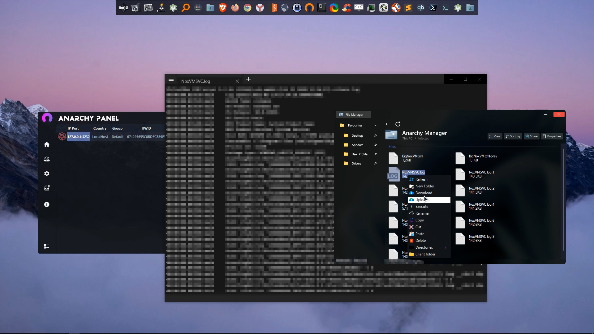
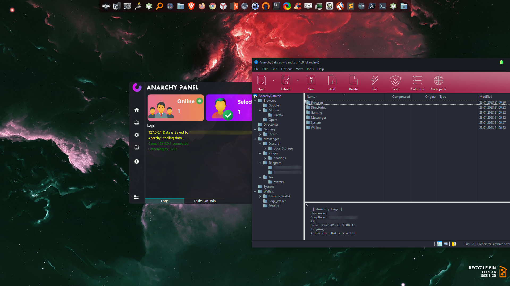

# Anarchy Panel HVNC RAT v4.7

Anarchy Panel HVNC RAT v4.7 is a powerful all-in-one hacking software for Windows, combining RAT (Remote Access Trojan), HVNC (Hidden VNC), and Stealer functionalities. With this software, you can remotely access and control a target PC or laptop, steal sensitive information such as bank login details, files, social media passwords, cookies, credit cards, and much more, all while remaining undetected.

## Features

- **RAT (Remote Access Trojan)**: Remotely hack into and control your victim's PC, enabling actions such as password stealing and more.
- **HVNC (Hidden VNC)**: Silently open and utilize the victim's browser, allowing you to bypass login pages and access accounts such as Gmail, PayPal, etc., without detection.
- **Stealer**: Steal various login details, passwords, credit card information, and other sensitive data from the victim's PC.
- **Multi-Hacking Software**: Combines multiple hacking features into one convenient tool, providing versatility and power for your hacking needs.

## How to Use

1. **Installation**: Download and install the Anarchy Panel HVNC RAT v4.7 software on your system.
2. **Setup**: Configure the software settings according to your requirements.
3. **Target Selection**: Choose your target PC or laptop for hacking.
4. **Remote Access**: Utilize the RAT feature to remotely access and control the target system.
5. **Information Theft**: Use the Stealer functionality to steal sensitive information from the victim's PC.
6. **Hidden Browser Access**: Employ the HVNC feature to secretly open and use the victim's browser for various purposes.

## Screenshots

## Disclaimer

The use of Anarchy Panel HVNC RAT v4.7 for unauthorized access to computers or networks without proper authorization may be illegal in some jurisdictions. Usage of this software should comply with all applicable laws and regulations. The developers and contributors of this software are not responsible for any misuse or illegal activities conducted with this tool.
